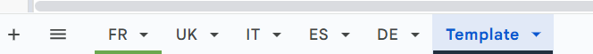
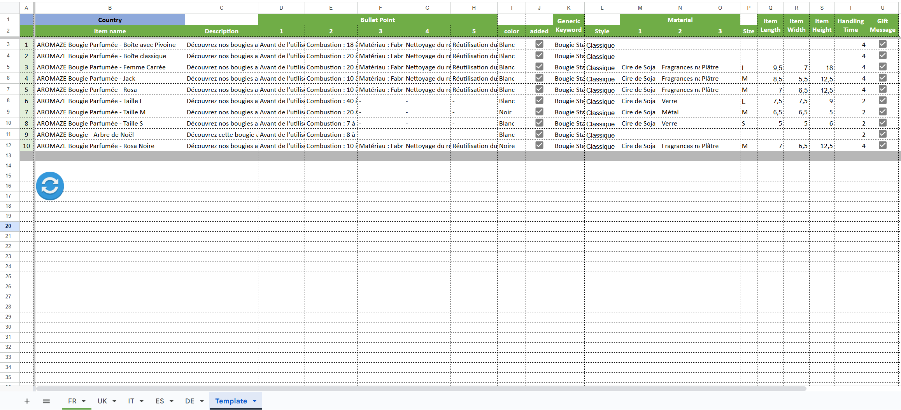

# 📊 Google Sheets Formatter Sync — for Amazon Inventory by Country

This Google Apps Script helps you **synchronize formatting and headers** across multiple sheets (one per country), based on a single *Template* sheet. It's optimized for inventory management across platforms like **Amazon FR, IT, DE, UK, ES**, etc.

Useful for e-commerce sellers who manage listings across **separate country-specific tabs** and want consistent formatting, headers, and cell structure.

---

## 🚀 Features

- ✅ Copies full formatting (colors, borders, font styles, number formats)  
- ✅ Duplicates column widths, row heights  
- ✅ Applies cell merges and frozen headers (like sticky header rows)  
- ✅ Copies content and format from frozen rows and frozen columns  
- ✅ Leaves your product data intact (only formatting is modified)  
- ⚡ Fast and scalable — you define how many rows/columns to sync  

---

## 📁 Sheet Structure

- *Template* – Your master format sheet (design + frozen header rows/columns)  
- *FR*, *IT*, etc. – Country-specific sheets to apply formatting to  
- The script will apply only to the countries you list in the config section  



---

## ⚙️ Configuration

In the script:

```
const countrySheetNames = ['FR', 'IT']; // Sheets to sync  
const NUM_ROWS = 50;                    // Max rows to apply formatting to  
const LAST_COLUMN = 'K';                // Last column (e.g. A–Z, AA–AZ, etc.)
```

These constants define **how much of the sheet** will be synchronized (from cell A1 to *LAST_COLUMN × NUM_ROWS*).

---

## 📐 What Gets Synced

```
| Element                   |Synced   | Notes                        |
|---------------------------|---------|------------------------------|
| Formatting (colors, font) | ✅     | Whole range                  |
| Column widths             | ✅     | As in *Template*             |
| Row heights               | ✅     | As in *Template*             |
| Merged cells              | ✅     | All inside defined range     |
| Frozen rows / columns     | ✅     | As in *Template*             |
| Data in frozen rows       | ✅     | Headers preserved            |
| Data in frozen columns    | ✅     | Left labels preserved        |
| Other cell data           | ❌     | Data below frozen area kept  |
```

---

## 🛠️ How to Use

1. Open your Google Sheet  
2. Go to *Extensions > Apps Script*  
3. Paste the *syncTemplateToCountrySheets* script  
4. Adjust the configuration variables at the top  
5. Press ▶️ to run the script manually  

(Optional) Add a **button** to run the script:  
- Insert > Drawing > Create a shape  
- Assign script: *syncTemplateToCountrySheets*

---

## 🧪 Example Use Case

You're selling candles on Amazon across Europe, and your sheet contains:  
- One tab per country (*FR*, *IT*, etc.)  
- A *Template* sheet with styling and headers  



You want all tabs to **look and behave the same**, with:  
- Frozen top headers (*Name*, *Scent*, *Size*)  
- Consistent fonts, alignments, borders  
- Preserved data rows below the headers  
